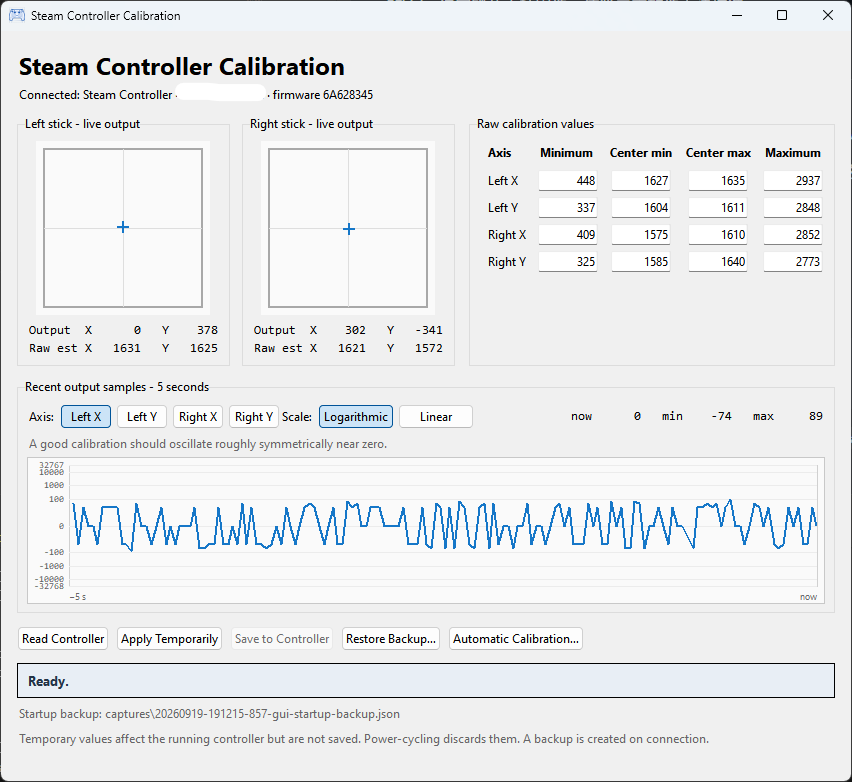
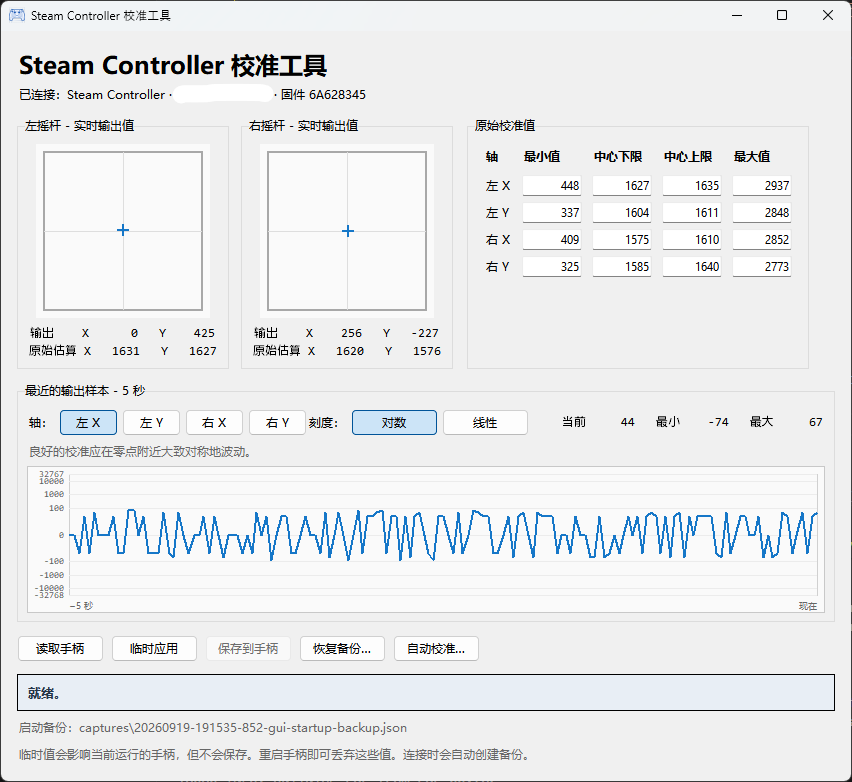

# Steam Controller Calibration Utility

## English | [中文](#Steam-Controller-校准工具)



This is not an official Valve product.  
For reasons only known to God and Gabe, Valve does not provide a way to calibrate the sticks on the Steam Controller (2026) in Steam. You can only adjust the deadzone in Steam. 

This is the "**Fine, I'll do it myself**" solution.  
It offers both auto calibration and manual input of calibration values if you are super OCD about getting the perfect centering.

This utility is usable as of September 2026. If future firmware updates break it, please let me know by opening an issue (or pull request). I will try to fix it if possible, unless Valve decides to lock down the controller firmware and make it impossible to calibrate by third-party software.

## Usage

**Connect the controller directly via USB**. Do not use the wireless puck during calibration.  
After calibration, you can use the wireless puck as normal, and do not need to keep the app running.

Calibration data are saved in `captures` folder, in case you need to restore them.

Please help test or report firmware versions that are marked as "untested" or "unknown" by submitting issues.

### Windows Executable

Download the latest from [Releases](releases).   
Windows Security may warn you about an unknown publisher. Click "More info" and then "Run anyway". Or you may download and review the source code yourself, and run it with Python.

### Python script

```bash
git clone https://github.com/omltcat/steam-controller-calibration.git
cd steam-controller-calibration
pip install -r requirements.txt
python -m src.gui
```

The GUI follows the Windows system language. Use `--language zh-CN` or `--language en` to force a specific language.

The command-line utility is available through the same package:

```bash
python -m src.main list
python -m src.main backup --path auto --output captures/my-backup.json
python -m src.main restore --path auto --backup captures/my-backup.json
```

## Further reading

The technical background, reverse-engineering process, firmware analysis, and
source provenance are in [Research](research/README.md).

# Steam Controller 校准工具

## [English](#Steam-Controller-Calibration-Utility) | 中文




这不是Valve官方的软件。  
神秘的G胖没有在Steam中提供校准 Steam Controller (2026) 摇杆的功能，只能调整死区。

这是我自己动手丰衣足食的解决方案。
本工具提供自动校准和手动输入校准值的功能，如果你是追求完美居中的强迫症患者，可以手动微调精确的校准值。

本工具在2026年9月可用。如果未来的固件更新把它搞坏了，请提交Issue告诉我（或Pull Request），也可以[B站私信我](https://space.bilibili.com/257463461)，我会尝试修复。除非Valve决定锁死手柄固件，使第三方软件无法校准。

## 使用方法

**请通过USB直连手柄**，校准时不要使用无线接收器。  
校准完成后，你可以像平常一样使用无线接收器，不需要保持本程序运行。

校准数据会保存在`captures`文件夹中，以便你需要可以恢复先前的校准。

请帮助测试或报告标记为“未测试”或“未知”的固件版本，提交Issue即可。

### Windows可执行文件
从[Releases](releases)下载最新版本。  
Windows安全可能会提示未知发布者，点击“更多信息”后选择“仍要运行”即可。或者你也可以选择下载并审查源代码后，使用Python运行。

### Python脚本

```bash
git clone https://github.com/omltcat/steam-controller-calibration.git
cd steam-controller-calibration
pip install -r requirements.txt
python -m src.gui
```

图形界面会跟随Windows系统语言。使用`--language zh-CN`或`--language en`可以强制指定语言。

本工具也提供命令行功能：
```bash
python -m src.main list
python -m src.main backup --path auto --output captures/my-backup.json
python -m src.main restore --path auto --backup captures/my-backup.json
```

## 更多资料
技术背景、逆向工程、固件分析和源代码来源请参阅 [Research](research/README.md)。
